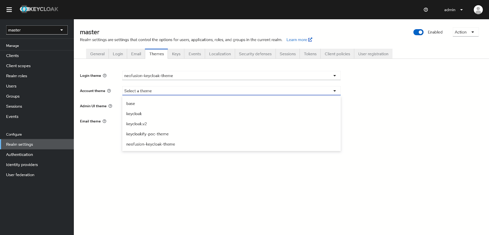
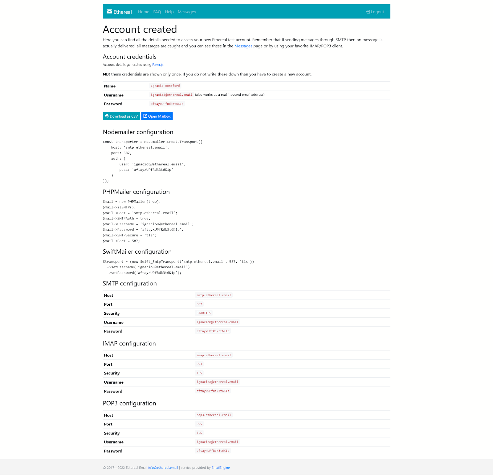
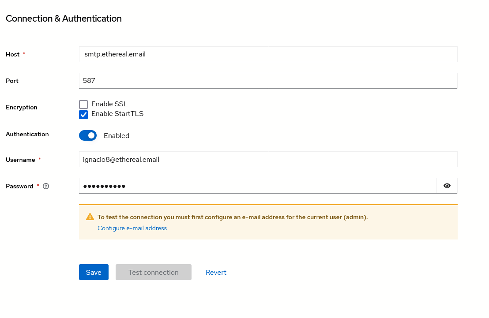

# Instructions

This project is using the following:

- Yarn package manager
- Docker compose
- PGAdmin
- Keycloak
- MaterialUI

For this project it is required to have at least:

- NodeJS `18.12.0`
- Yarn `1.22.19`
- Docker-compose `v2`

# Project Setup

## Enviromental variables

Please visit the `.env.example` file and make an `.env` file copy, in the root directory and fix it according to your needs.

_Variables are only used by the `docker-compose.yml` file._

## Extensions

Please visit the `neofusion-keycloak-theme.code-workspace` file to see settings regarding the project.

In order to modify FTL (freemaker template language) files, we are using a custom Syntax and Formatter for said files. This is automatically set up for you, if you are using VSCode.

There are also variaty of extensions added, here is a complete list:

- [ESLint](https://marketplace.visualstudio.com/items?itemName=dbaeumer.vscode-eslint) - Linting Tool ESLint
- [esbenp.prettier-vscode](https://marketplace.visualstudio.com/items?itemName=esbenp.prettier-vscode) - Prettier Formatter Tool
- [VSCode YAML](https://marketplace.visualstudio.com/items?itemName=redhat.vscode-yaml) - For YAML Files
- [Freemaker Syntax](https://marketplace.visualstudio.com/items?itemName=dcortes92.freemarker) - Syntax For FTL
- [Freemaker Formatter](https://marketplace.visualstudio.com/items?itemName=antonlilleby.xp-freemarker-formatter) - Formatter for FTL

## Commands

- Run `yarn` in the `neofusion-keycloak-theme` folder
- Run `yarn develop` in the root folder to create the nescessary Docker instances (in case you need a PG Admin instance as well instead of `yarn develop` run `yarn debug`)
- After running the mentioned commands, please go inside of the `neofusion-keycloak-theme` folder and run `yarn build-theme` (this process might take up to `3 minutes` - takes `90 seconds` after the initial build)
- Please follow the steps under `Assing your theme` (if you are working on the React Theme) and `E-mail test enviroment` (if you are working on custom e-mails). Afterwards, visit the `Development enviroment` and `Development cylce` in order to understand what to do next.

## Assign your theme

Login using your adming credentials, you can find your `username` and `password` by visiting the `.env` file and taking a look at `KEYCLOAK_ADMIN_USERNAME` and `KEYCLOAK_ADMIN_PASSWORD` variables.

After logging in, please visit the `Realm Settings` page.

Go under the `Themes` tab and set `neofusion-keycloak-theme` under:

- Login theme
- Account theme
- **Admin UI theme** - _this isn't supported._
- Email theme

Your `Theme` settings should look like this:

## E-mail test enviroment

Please visit the url [Ethereal.mail](https://ethereal.email/).

Click on `Create Ethereal Account`, you will be able to view a page like this:

After creating the e-mail with Ethereal we will use the variables to setup a fake Inbox for sending and recieving e-mail with `Keycloak` so we can see what we are developing.

Go under `Realm Settings` and

**Please note that StartTLS should be enabled for you.**

**Please keep in mind that there is a bunch of configuration up top, under Template. But you only need to fill in the From field (use e-mail provided by Ethereal.mail).**

_Your configuration should look something like this._

Click Save and you are ready to test emails.

**After these steps you are ready to go and develop the theme!**

# Development enviroment

`yarn storybook`

The makers of `Keycloakify` imagined that a suitable enviroment for development would be Storybook. I've updated all the dependencies to latest version and in order to develop a theme, without waiting on the `build-theme` cycle you can run `yarn storybook` (in the `neofusion-keycloak-theme` folder).

Storybook will run on `6006` port.

`yarn build-theme`

Builds the theme and creates a folder `build_keycloak` with 2 versions of the theme inside. One is an unpacked version that is aliased to our Docker instance of Keycloak. The other one is a `.jar` file that is used in Production enviroments and placed inside of the `providers` folder.

After the build cycle ends, you simply need to refresh your browser and you can view the modifications made.

## Development cycle

### React Development

If you are developing a React replacement for the UI (Login Page, Register page etc), you are safe to do your development inside of the Storybook enviroment. But always run `build-theme` and visit the Keycloak instance in order to check if everything is up to spec. Please, keep in mind, that some additional text might show up in the Storybook instances.

### E-mail development

Here you will have to wait for the build time and cycle the appropriate event through Keycloak in order to test.

I would recommend to use some outside HTML and Code editor like CodePen for development and just testing the end results through `build-theme`.

You can register mutliple e-mail aliases to your main GMail account, in order to rapidly test e-mail changes. If you need more information on how to do this please visit [this link.](https://www.101domain.com/gmail_email_aliases.htm)
